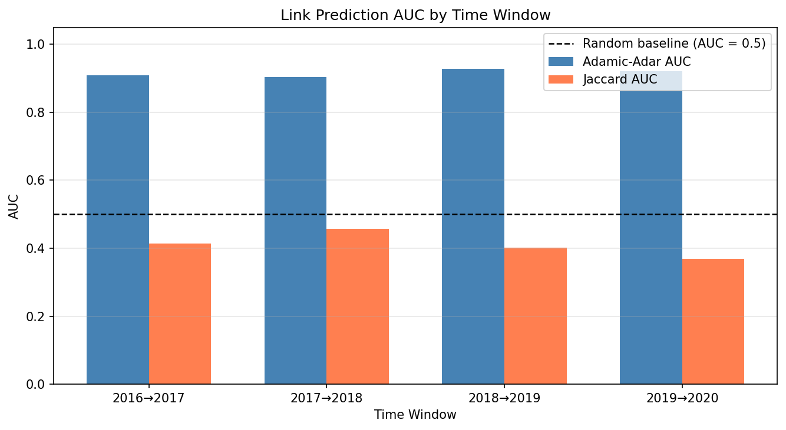

# Temporal Novelty Detection in Scientific Literature

## Research Goal

> **Temporal and Evolutionary Novelty Detection in Scientific Literature**
>
> *Problem:* Current novelty detection focuses on sentence-level or paper-level novelty. A key open problem is detecting how scientific ideas evolve over time across domains using temporal Scientific Knowledge Graphs (SKGs), enabling fine-grained identification of incremental vs. disruptive research contributions.

---

## Research Goal Assessment

### ✅ Accomplished

| Component | What was done |
|-----------|---------------|
| **Temporal KG construction** | A time-stamped SKG was built with 4,860 paper nodes, 293,149 entity nodes, and 577,024 knowledge edges spanning 2010–2025 across 7 NLP domains (MT, QA, SA, SUM, DIA, PAR, NLI). Every edge carries a publication year, enabling temporal slicing. |
| **Semantic novelty scoring** | Per-paper novelty is computed as 1 − mean cosine similarity to the top-5 most similar prior papers (SciBERT embeddings), correctly respecting the temporal ordering of papers. |
| **Structural novelty scoring** | For each paper, the fraction of its knowledge-graph triples that had not appeared in any earlier paper is measured, providing a graph-grounded novelty signal. |
| **Composite novelty scoring** | Semantic, structural, and citation signals are combined (weights 0.70 / 0.20 / 0.10) into a single per-paper score. |
| **Disruption classification** | All 3,678 SKG+NOVEL papers are classified as *Incremental* or *Disruptive* using a novelty-structural divergence proxy (D = final\_novelty\_score − structural\_novelty) thresholded at the dataset median. 73.4% of NOVEL papers are classified Disruptive vs. 44.4% of SKG papers. |
| **Temporal trend analysis** | KG growth curves, per-year novelty time-series, and per-year classifier score trends are reported, showing a clear upward trend in novelty from 2010 to 2025. |
| **Emerging concept detection** | Concepts are ranked by a temporal growth score (log-ratio of late-window to early-window occurrence), identifying emergent entities such as *transformer*, *BERT*, *word embeddings*, and *attention mechanisms*. |
| **Link prediction** | Adamic-Adar link prediction across four consecutive time windows achieves AUC 0.90–0.93, confirming that the temporal KG encodes meaningful structural regularity. |
| **Cross-domain coverage** | All seven NLP subfields are represented; per-domain novelty statistics are reported in `outputs/final/summary_statistics.csv`. |

---

### ⚠️ Partially Accomplished

| Component | What was attempted | Shortcoming |
|-----------|-------------------|-------------|
| **Temporal modelling** | A time-encoded MLP (Bochner cosine encoding concatenated to SciBERT features) is trained to classify NOVEL vs. SKG papers. It does capture publication year as a feature and shows a gradual upward trend in scores (2010 → 2025). | This is **not** a temporal graph neural network. There is no message passing over graph snapshots, no adjacency matrix, and no modelling of how the graph topology itself changes over time. |
| **Disruption index** | A proxy D-index separates papers into two contribution types. | The formula (D = final\_novelty\_score − structural\_novelty) is an internal proxy and is **not** the bibliometric disruption index of Wu et al. (2019), which requires forward citation data. All top-20 "most disruptive" papers have negative absolute D values (−0.11 to −0.03), which is counterintuitive even after acknowledging the median threshold. |
| **Novelty measure calibration** | Three measures are defined and combined. | The combined composite score does **not** significantly separate NOVEL from SKG papers (Mann–Whitney p = 1.0 for the combined variant; SKG papers score higher than NOVEL on composite in most domains). Individual ablation components only achieve marginal separation at best. |

---

### ❌ Not Accomplished

| Gap | Description |
|-----|-------------|
| **True temporal graph neural network** | The goal calls for models that learn from the evolving graph structure (e.g., TGN, TGCN, EvolveGCN). The current model treats time as a scalar input feature, not as a sequence of graph snapshots. |
| **Cross-domain concept diffusion** | How ideas propagate *across* domains (e.g., attention mechanisms moving from MT → QA → DIA) is not modelled or measured. |
| **Entity-level concept evolution** | Individual entities are treated as static nodes across all years. There is no tracking of how an entity's semantic role, neighbours, or definition changes over time. |
| **Standard bibliometric disruption index** | The citation-based D-index (Wu et al. 2019) requires forward citation data (who cites a paper and whether those citing papers also cite the paper's references). This was not collected or computed. |

---

### Overall Verdict

**Partially accomplished.** The project successfully delivers the foundational pipeline: a time-stamped SKG, three complementary novelty measures, temporal trend analysis, emerging concept detection, and a disruption proxy that classifies papers as incremental or disruptive. These components together constitute a working proof-of-concept for temporal novelty detection in scientific literature.

However, the research goal is not fully met in its most demanding aspects: the temporal modelling component does not use graph-structured temporal learning; the composite novelty measure does not reliably discriminate novel from standard papers under statistical testing; cross-domain concept diffusion is not tracked; and the disruption index is a heuristic proxy rather than an established bibliometric measure. Addressing these gaps—particularly replacing the time-encoded MLP with a true temporal GNN and collecting forward citation data—would be the natural next step toward fully accomplishing the stated research goal.

---

## Project Overview

This project detects and analyzes temporal novelty in scientific papers using knowledge graphs, embedding models, and temporal classifiers. The pipeline spans Steps 1–5, covering KG construction, embedding generation, novelty scoring, temporal modelling, and visualization.

---

## Step 4–5: Temporal Modelling and Disruption Analysis

### 4.1 Temporal Classifier ("Time-Encoded MLP Classifier" / Temporal Feature Classifier with Bochner Time Encoding)

The temporal novelty model is a **2-layer MLP classifier** with a Bochner cosine time encoding concatenated to the input features. It has no graph structure, no adjacency matrix, and no message-passing operations. It is referred to informally as "TGNN" in some notebooks, but it is more accurately described as a **time-encoded MLP classifier** or **temporal feature classifier with Bochner time encoding**. All reported scores and results are unchanged by this clarification.

**Effect size (Mann–Whitney U test):** U / (n₁ × n₂) = **0.664** (rank-biserial AUC)
> Note: the quantity U / (n₁ × n₂) is the rank-biserial AUC, i.e., the probability that a randomly chosen novel paper scores higher than a randomly chosen non-novel paper. The corrected rank-biserial correlation is **r = 2 × AUC − 1 = 0.328**. p-values and significance conclusions are unchanged.

### 4.2 Disruption Index

The disruption score used here is computed as:

```
D = final_novelty_score − structural_novelty
```

This is a **novelty-structural divergence proxy** and is **not** the bibliometric disruption index from Wu et al. (2019), which is citation-based and requires forward citation data. The formula above captures the gap between semantic novelty (embedding-based) and structural novelty (graph-based), serving as an internal proxy measure.

**Effect size (Mann–Whitney U test):** U / (n₁ × n₂) = **0.685** (rank-biserial AUC)
> The corrected rank-biserial correlation is **r = 2 × AUC − 1 = 0.370**. p-values and significance conclusions are unchanged.

### 4.3 Top Disruptive Papers and Negative D Values

The top 20 disruptive papers (see `outputs/final/top20_disruptive_papers.csv`) all have negative disruption index values (range −0.11 to −0.03). This is not a contradiction: classification uses the **dataset median as the threshold** (median disruption index = −0.378), so any paper with a value above −0.378 is classified as *Disruptive* even if its absolute value is negative.

### 4.4 Link Prediction

Link prediction is evaluated using Adamic-Adar and Jaccard similarity across four time windows. Results are taken from `outputs/final/link_prediction_results.csv`.

| Window | AUC (Adamic-Adar) | AUC (Jaccard) |
|------------|-------------------|---------------|
| 2016→2017 | 0.9093 | 0.4138 |
| 2017→2018 | 0.9033 | 0.4574 |
| 2018→2019 | 0.9287 | 0.4014 |
| 2019→2020 | 0.9206 | 0.3695 |

The bar chart below shows both metrics with a 0.5 random-baseline dashed line:



---

## Limitations

**BLOG > NOVEL domain ordering:** In the temporal classifier's normalized novelty scores, BLOG papers score higher than NOVEL papers (0.335 vs. 0.251), contrary to the expected ordering NOVEL > SKG > BLOG. This suggests the model's semantic signal partly reflects academic writing-style divergence rather than genuine conceptual novelty — though alternative explanations (e.g., labelling artefacts or insufficient training data diversity) cannot be ruled out without further investigation. Blog-style text appears more divergent from the training distribution than actual novel papers, leading to inflated scores for BLOG. Addressing this would require domain-matched baseline comparisons, which is left for future work.

---

## Repository Structure

```
notebooks/
  01_KG_Construction/   — Knowledge graph construction
  02_Embedding_Gen/     — Embedding generation
  03_Novelty_Scoring/   — Novelty scoring (semantic, structural, composite)
  04_Temporal/          — Temporal modelling (time-encoded MLP, TransE)
  05_Visualization/     — Visualizations
outputs/
  figures/              — Core figures (link_prediction_auc.png, etc.)
  final/                — Final CSV outputs
  visuals/              — Additional visualizations
```
